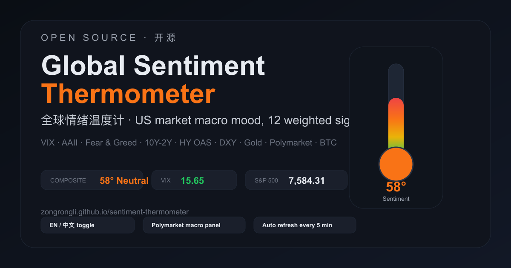

<h1 align="center">🌡️ Global Sentiment Thermometer · 全球情绪温度计</h1>

<p align="center">
  <em>US market macro sentiment dashboard — 12 weighted indicators across volatility, rates, credit, geopolitics, crypto, and Polymarket.</em>
  <br/>
  <em>美股宏观情绪看板 — 综合波动率、利率、信用、地缘、加密与 Polymarket 的 12 项加权指标。</em>
</p>

<p align="center">
  <a href="https://github.com/topics/market-sentiment"></a>
  <a href="https://github.com/topics/trading-tools"></a>
  <a href="https://github.com/topics/polymarket"></a>
  <a href="https://zongrongli.github.io/sentiment-thermometer/"></a>
  <a href="https://github.com/ZongrongLi/sentiment-thermometer/actions/workflows/update-data.yml"></a>
  <a href="#license"></a>
</p>

<p align="center">
  
</p>

<p align="center">
  <strong>English first.</strong> This README is bilingual and organized as EN → 中文.
</p>

<p align="center">
  <a href="#demo">English</a> · <a href="#中文说明">中文</a>
</p>

---

## Demo

| Version | Link | Notes |
|---|---|---|
| GitHub Pages | [zongrongli.github.io/sentiment-thermometer](https://zongrongli.github.io/sentiment-thermometer/) | Static snapshot, auto-updated every 6 hours |
| Local full app | `http://localhost:8866` | Live backend, refreshes every 5 minutes |

> GitHub Pages serves the latest generated snapshot. For live market fetches, run the local backend.

---

## Preview

<p align="center">
  
</p>

---

## Features

- Composite 0–100 sentiment thermometer with color states from extreme fear to extreme greed
- 12 weighted indicators: VIX, Put/Call, AAII, Fear & Greed, 10Y-2Y, HY OAS, DXY, Gold, TED, S&P vs 200MA, BTC Fear & Greed, Polymarket macro heat
- Polymarket panel for Fed decisions, easing expectations, geopolitics, and crypto speculation
- Sector heatmap for 11 S&P sector ETFs
- Trend chart for 1M / 3M / 1Y sentiment history
- Auto refresh every 5 minutes in local mode
- Static GitHub Pages deployment with scheduled snapshot updates
- Dark theme and bilingual interface

---

## Architecture

```text
GitHub Pages (static snapshot)
  └─ reads data/snapshot.json
     └─ refreshed by GitHub Actions every 6 hours

Local app (FastAPI on :8866)
  ├─ /api/temperature
  ├─ /api/history
  ├─ /api/sectors
  └─ fetches from Yahoo Finance, CNN Fear & Greed, AAII, alternative.me, and Polymarket
```

---

## Quick Start

### Run locally

```bash
git clone https://github.com/ZongrongLi/sentiment-thermometer.git
cd sentiment-thermometer
pip install -r requirements.txt
python3 server.py
open http://localhost:8866
```

### GitHub Pages deployment

1. Fork this repository
2. Go to Settings → Pages
3. Set source to the `gh-pages` branch
4. Run the workflow once from Actions if you need the first snapshot immediately
5. Open your Pages URL

---

## Data Sources

| Indicator | Source | Type | Cost |
|---|---|---|---|
| VIX / S&P 500 / DXY / Gold / 10Y / sector ETFs | Yahoo Finance via `yfinance` | Market data | Free |
| Fear & Greed | CNN Business | Sentiment index | Free |
| BTC Fear & Greed | `alternative.me` | Crypto sentiment | Free |
| AAII bull-bear spread | `aaii.com` HTML scrape | Survey sentiment | Free |
| Polymarket macro panel | Polymarket Gamma API | Prediction market data | Free |
| Put/Call / HY OAS / TED / parts of yield spread / S&P vs 200MA | Derived proxy values | Proxy series | Free |

> Note: several indicators are proxy-derived rather than direct institutional feeds. That is explicitly intentional for a fully free public build.

---

## Refresh Model

- Local backend: fetches live data and refreshes the UI every 5 minutes
- GitHub Pages: generates `data/snapshot.json` on a 6-hour GitHub Actions schedule
- If a live source is temporarily unavailable locally, the UI can fall back gracefully instead of crashing

---

## SEO / Discoverability

This repo is named and tagged so both English and Chinese users can find it for searches like:

- market sentiment dashboard
- fear and greed dashboard
- polymarket macro tracker
- macro thermometer
- 全球情绪温度计
- 美股宏观情绪看板
- 市场情绪温度计

Recommended GitHub topics:

`market-sentiment`, `macro-dashboard`, `polymarket`, `fear-and-greed`, `vix`, `finance-dashboard`, `trading-tools`, `sentiment-analysis`, `global-sentiment-thermometer`, `meigu-hongguan`, `quanqiu-qingxu-wenduji`

---

## Roadmap

- Add more real macro series via FRED
- Add Pages history snapshots instead of a single-point snapshot
- Expand Polymarket panels for oil, recession, China/Taiwan, and election risk
- Add shareable permalinks and social preview cards

---

## 中文说明

### 介绍

这是一个面向美股宏观交易视角的情绪看板，把不同来源的风险偏好、信用、波动率、收益率曲线、加密投机、预测市场信息统一映射成一个 0–100 的“温度计”。

### 在线体验

- GitHub Pages：[`https://zongrongli.github.io/sentiment-thermometer/`](https://zongrongli.github.io/sentiment-thermometer/)
- 本地完整版：`http://localhost:8866`

### 核心能力

- 综合温度计：从“极度恐慌”到“极度贪婪”
- 12 项加权指标：VIX、Put/Call、AAII、Fear & Greed、10Y-2Y、HY OAS、DXY、黄金、TED、S&P vs 200MA、比特币 F&G、Polymarket 宏观热度
- Polymarket 看板：联储决议、降息预期、地缘风险、加密投机热度
- 板块热度：11 个美股行业 ETF
- 趋势图：1 月 / 3 月 / 1 年
- 本地 5 分钟自动刷新，Pages 6 小时自动更新快照
- 现在支持前端中英文切换

### 本地启动

```bash
git clone https://github.com/ZongrongLi/sentiment-thermometer.git
cd sentiment-thermometer
pip install -r requirements.txt
python3 server.py
open http://localhost:8866
```

### 静态部署

1. Fork 仓库
2. 在 GitHub Pages 里选择 `gh-pages` 分支
3. 等待 Actions 跑完
4. 打开你的 Pages 地址

### 数据说明

- 绝大部分公开数据源都是免费的
- Polymarket 面板来自公开 Gamma API
- 一部分指标是代理值，不是假数据，而是为了免费公开部署做的近似构造

---

## License

This project is released under the [MIT License](LICENSE).

See also: [`CONTRIBUTING.md`](CONTRIBUTING.md) · [`CODE_OF_CONDUCT.md`](CODE_OF_CONDUCT.md) · [`CHANGELOG.md`](CHANGELOG.md)
